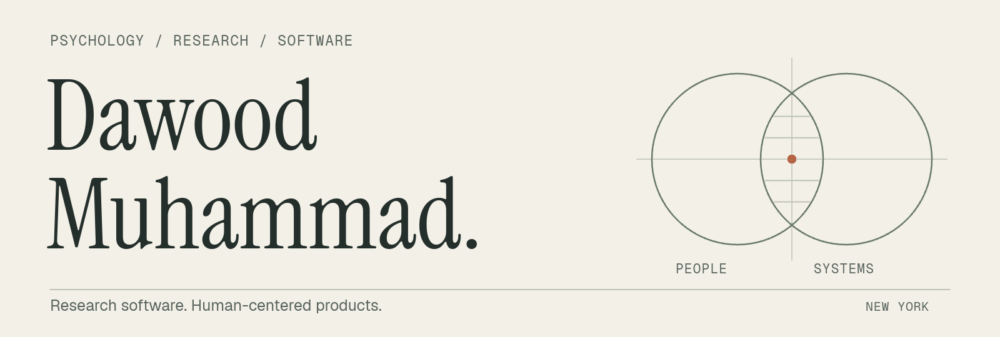

<picture>
  <source media="(max-width: 600px)" srcset="assets/masthead-mobile.png">
  
</picture>

  <a href="https://github.com/Dawood-Muhammad/human-causal-reality-engine">Code</a>
  &nbsp; · &nbsp;
  <a href="SELECTED-WORK.md">Work</a>
  &nbsp; · &nbsp;
  <a href="https://www.linkedin.com/in/dawood-muhammad-135946328/">LinkedIn</a>
  &nbsp; · &nbsp;
  <a href="mailto:Dawoodman@outlook.com">Contact</a>

### I turn questions about people into working software.

I'm a **Stony Brook psychology graduate** building research tools, AI evaluations, and interactive behavioral experiments. My experience in behavioral research and frontline care shapes the work: clear evidence, visible uncertainty, and meaningful choices for the person using it.

PYTHON &nbsp; / &nbsp; TYPESCRIPT &nbsp; / &nbsp; REACT &nbsp; / &nbsp; FASTAPI &nbsp; / &nbsp; SQL &nbsp; / &nbsp; RESEARCH DESIGN

## Featured work

### Human Causal Reality Engine

A local research workbench that keeps **source evidence, analysis, and reproducible results** together. I built the Python core, React dashboard, and offline verification workflow.

  

**[Explore the code ↗](https://github.com/Dawood-Muhammad/human-causal-reality-engine)** &nbsp; · &nbsp; [Run an example](https://github.com/Dawood-Muhammad/human-causal-reality-engine#try-it) &nbsp; · &nbsp; [Review the engineering](https://github.com/Dawood-Muhammad/human-causal-reality-engine#review-the-engineering) &nbsp; · &nbsp; [CI results](https://github.com/Dawood-Muhammad/human-causal-reality-engine/actions/workflows/ci.yml)

Public source · MIT · Active R&D. Fixed analyses and replay are implemented; causal prediction and independent scientific validation remain future work. The screenshot's measurement rows are not independent animals or experiments.

 

## More work

**[Neural Intent Lab ↗](SELECTED-WORK.md#neural-intent-lab)** &nbsp; `Python` `TypeScript` 
EEG evaluation paired with a sandbox that separates a model's score from permission to act.

**[EquityBench ↗](SELECTED-WORK.md#equitybench)** &nbsp; `Python` `AI evaluation` 
Replayable de-identification checks with separate limits for privacy misses and useful text removed.

**[Cognitive Bias Lab ↗](SELECTED-WORK.md#cognitive-bias-lab)** &nbsp; `React` `Experimental design` 
Four interactive behavioral tasks with transparent methods and a delayed debrief.

These are public case studies of private-source prototypes. Their evidence and limitations are documented in the gallery.

**[View all seven projects ↗](SELECTED-WORK.md)**, including ShiftLens, Memory Distortion Studio, and How to Show Up.

 

---

**Good research needs good tools.** 
[Let's talk about what you're building.](mailto:Dawoodman@outlook.com)
