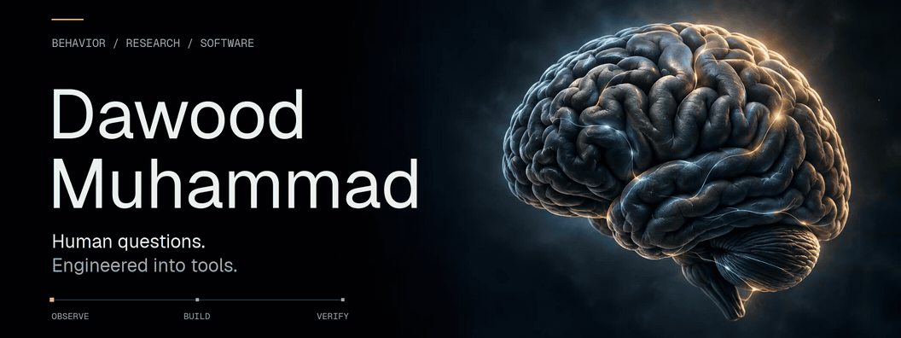

<picture>
  <source media="(prefers-reduced-motion: reduce)" srcset="assets/profile-banner.png">
  
</picture>

  <a href="https://github.com/Dawood-Muhammad/human-causal-reality-engine"><b>Explore HCRE ↗</b></a>
  &nbsp; · &nbsp;
  <a href="https://github.com/Dawood-Muhammad/Dawood-Muhammad/blob/main/SELECTED-WORK.md"><b>Selected work ↗</b></a>
  &nbsp; · &nbsp;
  <a href="https://www.linkedin.com/in/dawood-muhammad-135946328/"><b>LinkedIn ↗</b></a>
  &nbsp; · &nbsp;
  <a href="mailto:Dawoodman@outlook.com"><b>Get in touch ↗</b></a>

## A psychology background. An engineering mindset.

I’m **Dawood Muhammad**. I build research software, AI evaluation tools, and interactive experiences around how people think, decide, and act.

My perspective comes from a **B.S. in Psychology at Stony Brook University**, behavioral research, and hands-on work in direct support and care operations. I bring that experience into the things I build: thoughtful interfaces, inspectable evidence, and clear control over what happens next.

**Python · TypeScript · React · SQL · FastAPI · Scientific computing**

### The flagship: HCRE

**[Human Causal Reality Engine](https://github.com/Dawood-Muhammad/human-causal-reality-engine)** connects a research question to its evidence, analysis, and complete result record in one local workbench.

I designed and built the **Python core, React dashboard, typed data contracts, and offline replay workflow**. A reviewer can trace an input, inspect the calculation, and reproduce the recorded result.

[**Read the source →**](https://github.com/Dawood-Muhammad/human-causal-reality-engine) &nbsp; [**Run the synthetic example →**](https://github.com/Dawood-Muhammad/human-causal-reality-engine#try-it)

Active R&D. The workbench and fixed analyses are implemented; causal prediction and independent scientific validation remain future milestones.

### More questions I’ve built around

| Project | The question → what I built |
| :--- | :--- |
| **[Neural Intent Lab](SELECTED-WORK.md#neural-intent-lab)** | What should follow an uncertain EEG prediction? A Python evaluation pipeline and a React sandbox separating prediction, permission, and simulated action. |
| **[EquityBench](SELECTED-WORK.md#equitybench)** | When should an AI release be blocked? A reproducible comparison of privacy misses and over-redaction, with explicit release criteria. |
| **[ShiftLens](SELECTED-WORK.md#shiftlens)** | Who owns the next step in a handoff? A care-transition review workspace that makes obligations, deadlines, and evidence visible. |
| **[Cognitive Bias Lab](SELECTED-WORK.md#cognitive-bias-lab)** | How does a prompt shape a decision? Four interactive behavioral tasks with versioned stimuli and delayed debriefs. |
| **[Memory Distortion Studio](SELECTED-WORK.md#memory-distortion-studio)** | How does wording change recall? A staged observation experience with neutral retrieval and a corrective debrief. |
| **[How to Show Up](SELECTED-WORK.md#how-to-show-up)** | Can software help someone find their own words? A private conversation-preparation tool with an editable, intentional sharing step. |

Independent research and portfolio prototypes. The project gallery includes interfaces, implementation details, and the scope of each build.

### What I bring to a team

- **Research thinking:** experimental design, quantitative analysis, and careful interpretation of evidence.
- **End-to-end building:** Python analysis, typed interfaces, usable products, and reproducible verification.
- **Experience with people:** behavioral support, staff coordination, and documentation in real care settings.

I’m interested in **research software, AI evaluation, and human-centered product work**—especially where understanding people is part of the technical challenge.

**[Let’s talk about what you’re building.](mailto:Dawoodman@outlook.com)**
