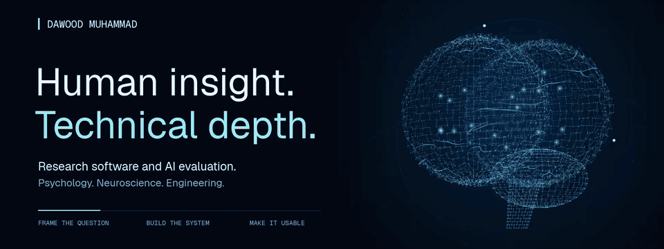

  
  &nbsp;
  
  &nbsp;
  

## I build the human side of intelligent systems.

I'm **Dawood Muhammad**, a Stony Brook psychology graduate building at the intersection of **neuroscience, AI evaluation, and product engineering**.

My advantage is the combination: behavioral research, experience supporting people in care settings, and the ability to build the software. I can frame the human question, design the experiment, and turn it into a working tool.

**Seven independent builds.** Python research engines, EEG evaluation, AI release gates, and interactive behavioral experiments. Each project connects a real question to something you can inspect.

**Python · TypeScript · React · FastAPI · SQL · SPSS**

### HCRE: an ambitious research idea, built end to end

**[Human Causal Reality Engine](https://github.com/Dawood-Muhammad/human-causal-reality-engine)** is my flagship research workbench. It brings source evidence, analysis, and reproducible results into one local workspace.

**I designed and built the Python core, React dashboard, and verification workflow.** The engineering connects the whole journey:

**Source evidence → Checked inputs → Analysis → Result bundle → Offline replay**

Typed contracts keep the interfaces consistent. Immutable bundles preserve the complete run. Independent Python and JavaScript implementations check a shared contract. The result is a research system a reviewer can open, question, and reproduce.

[**Explore the source ↗**](https://github.com/Dawood-Muhammad/human-causal-reality-engine) &nbsp; [**Run the example ↗**](https://github.com/Dawood-Muhammad/human-causal-reality-engine#try-it)

Active R&D. The workbench and fixed analyses are implemented. Causal prediction and independent scientific validation remain future milestones.

### A few more ways I turn questions into products

<table>
<tr>
<td width="50%" valign="top">
<h3><a href="SELECTED-WORK.md#neural-intent-lab">Neural Intent Lab ↗</a></h3>

<b>EEG models meet human control.</b>

A Python EEG evaluation pipeline paired with a React decision sandbox. Every step from prediction to permission is an explicit, inspectable state.

Python · TypeScript · React · EEG evaluation
</td>
<td width="50%" valign="top">
<h3><a href="SELECTED-WORK.md#equitybench">EquityBench ↗</a></h3>

<b>An AI release decision you can replay.</b>

A reproducible gate for comparing de-identification detectors. Separate privacy and utility budgets turn model evaluation into a clear release decision.

Python · AI evaluation · CLI / CI · Replay
</td>
</tr>
<tr>
<td width="50%" valign="top">
<h3><a href="SELECTED-WORK.md#shiftlens">ShiftLens ↗</a></h3>

<b>Make the missing handoff visible.</b>

A care-transition review workspace that connects obligations, owners, deadlines, and evidence. Review history preserves the original audit through confirmation and undo.

React · TypeScript · FastAPI · SQLite
</td>
<td width="50%" valign="top">
<h3><a href="SELECTED-WORK.md#cognitive-bias-lab">Cognitive Bias Lab ↗</a></h3>

<b>Behavioral science you can step inside.</b>

Four interactive tasks exploring anchors, framing, defaults, and rule testing. Versioned stimuli and delayed debriefs make experimental design part of the experience.

React · TypeScript · Experimental design
</td>
</tr>
</table>

I also built **[Memory Distortion Studio](SELECTED-WORK.md#memory-distortion-studio)**, an observation-and-recall experience, and **[How to Show Up](SELECTED-WORK.md#how-to-show-up)**, a private tool for preparing a difficult conversation.

[**See the full project gallery and the decisions behind each build ↗**](SELECTED-WORK.md)

Independent research and portfolio prototypes. Each case study explains its implementation, evidence, and current scope.

### A different route into engineering. A useful perspective.

My experience spans **behavioral research at Stony Brook**, direct behavioral support, and residential-program operations. I've worked with data, protocols, staff, families, and the practical demands of care.

That background shapes the software: how uncertainty is communicated, when someone gets a choice, what a record needs to preserve, and whether the next step is clear. I bring that perspective to research and AI teams, together with the ability to build the system around it.

**Have a research question that needs a real tool? [Let's build it.](mailto:Dawoodman@outlook.com)**

[LinkedIn](https://www.linkedin.com/in/dawood-muhammad-135946328/) · [Project gallery](SELECTED-WORK.md) · [Still version of the artwork](assets/neural-profile.png)
