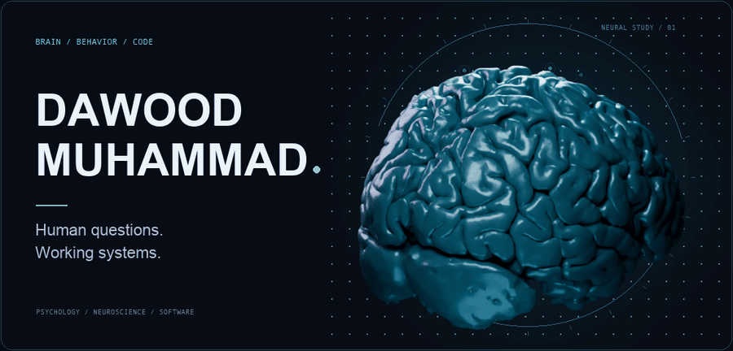

<picture>
  <source media="(prefers-reduced-motion: reduce)" srcset="assets/brain-banner.png">
  
</picture>

## I build software for understanding people.

I'm **Dawood Muhammad**, a builder with a B.S. in Psychology from **Stony Brook University** and frontline care experience. I turn questions about cognition, evidence, and human agency into research tools and interactive products.

My work connects **neuroscience · behavioral science · AI evaluation · human-centered software**.

[Explore HCRE](https://github.com/Dawood-Muhammad/human-causal-reality-engine) · [LinkedIn](https://www.linkedin.com/in/dawood-muhammad-135946328/)

### Currently building → HCRE

**[Human Causal Reality Engine](https://github.com/Dawood-Muhammad/human-causal-reality-engine)** is a research workbench for tracing evidence, inspecting analyses, and replaying results offline. I built its Python analysis pipeline, cross-language contracts, and React dashboard.

**Trace the source. Inspect the analysis. Replay the result.**

*Active R&D. The workbench and fixed offline analyses are implemented; causal prediction and independent scientific validation remain future milestones.*

### Other work on my bench

| Signals & decisions | People & experience |
| :--- | :--- |
| **Neural Intent Lab** — EEG evaluation and a policy sandbox that keeps simulated actions under human control. | **Cognitive Bias Lab** — interactive behavioral tasks with transparent methods and delayed debriefs. |
| **EquityBench** — reproducible privacy evaluations and explicit release criteria. | **Memory Distortion Studio** — an interactive study of wording, recall, and corrective debriefing. |
| **ShiftLens** — evidence-linked review of care-transition obligations, owners, and deadlines. | **How to Show Up** — a private authoring space for preparing a difficult conversation. |

*Research and portfolio prototypes. Private project source stays private; HCRE is available to explore above.*

### How I build

**Python · TypeScript · React · SQL · Three.js**

I care about reproducible results, clear interfaces, and giving people control over what a system does. The method should be visible in the product.

---

Brain artwork adapted from Anderson Winkler's <a href="https://brainder.org/research/brain-for-blender/">Brain for Blender</a> · <a href="https://creativecommons.org/licenses/by-sa/3.0/">CC BY-SA 3.0</a> · <a href="assets/ATTRIBUTION.md">Artwork credits & changes</a>
