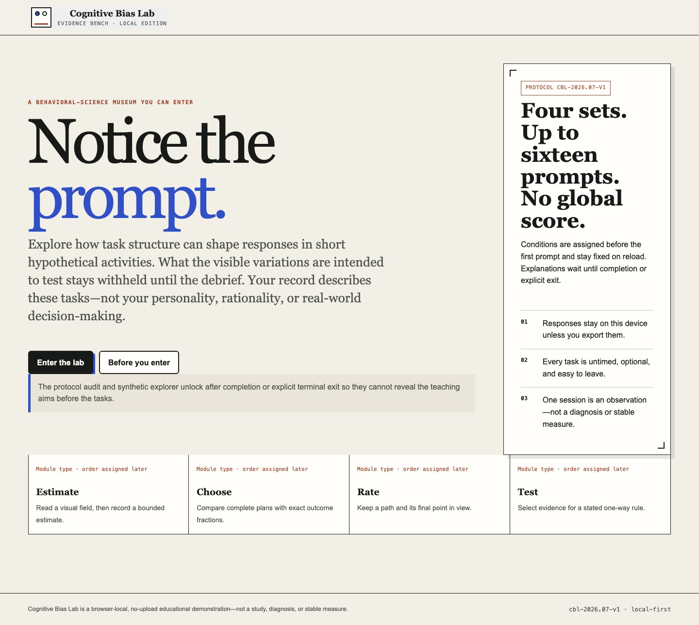
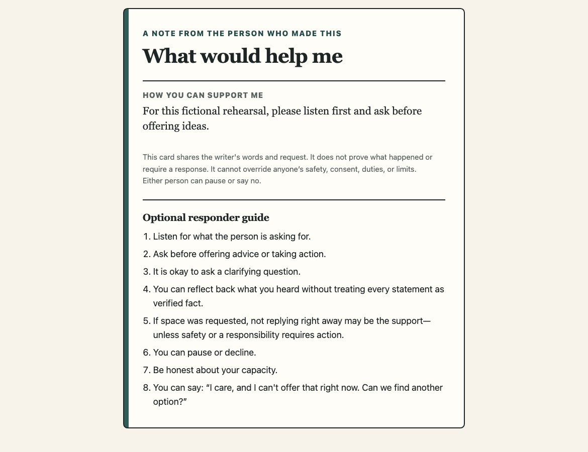

# Selected work

**Dawood Muhammad · Psychology, research, and software**

[Back to my profile](https://github.com/Dawood-Muhammad) · [HCRE source](https://github.com/Dawood-Muhammad/human-causal-reality-engine) · [LinkedIn](https://www.linkedin.com/in/dawood-muhammad-135946328/) · [Contact](mailto:Dawoodman@outlook.com)

These independent builds turn questions about evidence, behavior, and human control into working interfaces and inspectable systems. HCRE has public source; the projects below are presented as portfolio case studies. Screenshots show project interfaces and demonstration data.

## Neural Intent Lab

**An uncertain prediction is a design problem as well as a modeling problem.**

I built a Python pipeline for evaluating public EEG data and a typed React policy sandbox. The interface separates observing a score, suggesting a next step, requesting confirmation, acting, refusing, and undoing. An event ledger makes each transition inspectable.

**Engineering focus:** participant-held-out evaluation, calibration checks, typed state transitions, explicit authorization, and reproducible fixtures.

**Scope:** the five-participant development run was inconclusive, so the measured path stays observe-only. Sandbox actions are simulated; this is not a thought decoder or a real-device controller.

`Python` `TypeScript` `React` `EEG evaluation` `State machines`

## EquityBench

**Make the release decision explainable and reproducible.**

I built a local evaluation gate comparing a candidate de-identification detector with a fixed baseline. Privacy misses and useful text removed have separate risk limits. The report explains a PASS or BLOCK decision, and a replayable proof bundle preserves its inputs and reasoning.

**Engineering focus:** deterministic evaluation, exact span comparisons, separate risk budgets, atomic publication, and tamper rejection.

**Scope:** eight original synthetic cases demonstrate the release workflow. They do not establish performance on real records or regulatory compliance.

`Python` `CLI / CI` `AI evaluation` `Deterministic replay`

## ShiftLens

**Turn a missed handoff obligation into something a reviewer can inspect.**

I built a review workspace for care-transition integration QA. It brings the obligation, responsible owner, deadline, and supporting evidence into one view. Confirming a finding or undoing that confirmation adds to the review history while preserving the original policy audit.

**Engineering focus:** explicit clocks, immutable audit results, revision-checked commands, compensating undo, and exports that omit source text.

**Scope:** a synthetic structural-contract demonstration; it does not connect to a live EHR or establish clinical effectiveness.

`React` `TypeScript` `FastAPI` `SQLite` `FHIR`

## Cognitive Bias Lab

**Make experimental design something people can experience.**

I translated four behavioral task structures into an accessible browser experience: anchoring, framing, defaults, and rule testing. Versioned stimuli and deterministic counterbalancing keep the task logic inspectable. Visitors receive a delayed debrief grounded in their own responses.

**Engineering focus:** experimental structure, accessible untimed controls, local response storage, exports, and a clear separation between participant records and synthetic teaching examples.

**Scope:** an educational research prototype, not a diagnostic tool or a personality score.

`React` `TypeScript` `Experimental design` `Playwright`

## Memory Distortion Studio

**Let visitors trace a remembered detail back to its source.**

I designed a six-item experience around an original archive-room scene. Observation, later wording, neutral retrieval, and correction occupy separate stages. The debrief reconnects the original detail, prompt, response, and confidence so misleading wording receives an explicit correction.

**Engineering focus:** seeded conditions, sequence-preserving state transitions, session persistence, contamination flags, export, and deletion controls.

**Scope:** an educational prototype, not a validated memory assessment. Deterministic fixtures are software test data.

`React` `TypeScript` `Research UX` `State machines`

## How to Show Up

**Help someone prepare to speak while keeping the words theirs.**

I built a seven-step flow for preparing a support card before a difficult, non-emergency conversation. Prompts are optional, the author’s language stays editable, and private reflection is separated from the exact card they choose to share.

**Engineering focus:** optional interaction paths, an explicit draft-to-card projection, exact previews, accessible controls, and copy, download, and print workflows.

**Scope:** a preparation tool. It does not infer feelings, provide therapy, or assess risk.

`React` `TypeScript` `Privacy` `Accessibility` `Product writing`

---

**Interested in the decisions behind a build? [Get in touch.](mailto:Dawoodman@outlook.com)**
